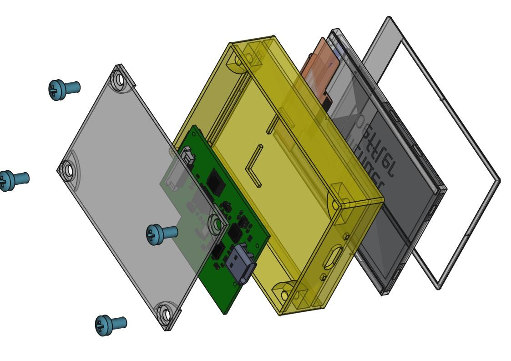
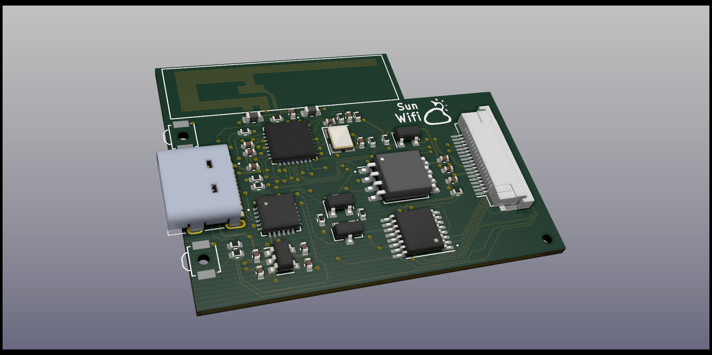
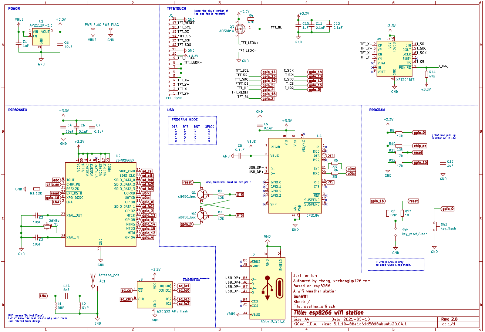
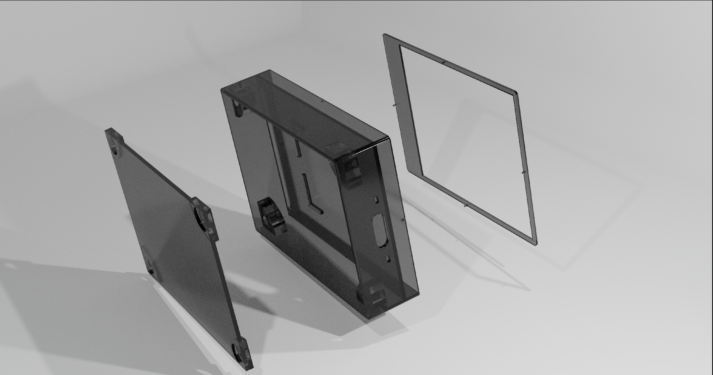

Reading the other language version: [简体中文](README.md)

# 0. Wifi Touch Extension Screen

This is a **small 2.4-inch touch screen with WiFi connectivity**. The current initial software version has added **weather forecast and clock functions**, which can be implemented through further software updates such as blog/video viewing, fan count, and a dedicated terminal with Server as remote control, etc.

**The whole project was completed by me alone, including circuit schematic diagram design, code writing and 3D shell design**, and the material cost of the whole project was only about a few dozen CNY. The main controller used is ESP8266EX, which is a WiFi chip from Espressif which is very popular in open source projects, and it is also very cheap. The screen is a 2.4-inch TFT screen powered by the ILI9341, and an XPT2046 drives the touchscreen for interactive control.

***This is my first complete personal project involving the whole process of circuit, software and 3D modeling design. Welcome to star and thumb up attention !***

> This is also the first time I tried to use **open source platform** to carry out the whole process of development, and the whole project basically did not use any commercial software and framework. During this process, I felt more and more the charm and power of the open source world, and also made a small participation in the open source world here~

**Development Platform**

I basically carried out all the development process on my `Thinkpad x1c`, using the Linux distribution version `ubuntu20.04` which I am familiar with. Since the subsequent ones are also open source platforms, there is basically no need to worry about platform compatibility issues. Even if there is no corresponding binary precompiled version, it can eventually be used by compiling the source code yourself. I have to say that Ubuntu's GUI stability has been fairly stable, with almost no crashes occurring during the whole process.

# 1. Circuite Design

The open source KiCad [^1] is chosen here. As the whole process is developed for the first time, there are not too many complex elements added to the circuit. However, I did not expect that there were many problems in the middle.

## 1.1 Schematic Design

First before the design is conceived and chip selection, the process is mainly a large number of technical manual reading, analysis the technical attributes of each chip such as power supply current and the pressure value, etc., and then according to the manual content, and his idea to design schematic diagram, since may work are mainly do the software, for hardware still not familiar with, The principle diagram of the first edition has been a lot of mistakes, thought should take the smallest time link has spent the most time of illness, this process on a lot of pit, is painful, almost give up :skull:, but insisted on screening out all of the hardware design problems and in the second edition correction succeeded :smile:.

>  On the schematic diagram I have also marked some of the previous potholes for your reference

## 1.2 Pcb Layout

The goal of this project is as small as possible, so of choice on the PCB assembly is QFN such small packaging, finished product basic coin size effect, but it has also led to the back of the screen hardware become very difficult, if in the circumstance that does not have too big hold back the first edition of PCB should lead to test as many mouth and some design need to be more convenient.

* 2.4g Antenna Design

The main point that needs to be paid attention to in PCB design is that 2.4GHz WiFi antenna is needed in the project, and the appropriate antenna wavelength /4 corresponding to the 2.4GHz frequency band is about 30.6mm, so it is completely enough to realize it directly with PCB wiring. I have also found a lot of information about antenna design here. It is highly recommended that you have a look at TI's document [DN035](doc/antena_choose_ti.pdf) which gives you a lot of simple antenna designs for different frequencies because RF antennas are very specialized and can be used directly for reference. For more details, see the article [How to Design a PCB Antenna For 2.4 GHz](https://circuitdigest.com/article/how-to-design-a-pcb-antenna-for-24ghz)

# 2. 3D Modeling of Shell

The shell design is Freecad [^2], and the logical process of software design is relatively simple and easy to understand. However, it should be noted that the latest `0.19` development version is needed at present. Although this version has not been officially released, it corrects many stability problems compared with the current release version `0.18`. You can go to GitHub and download the latest rolling development version.

Here I also give the STL file of the shell in this repo, which can be directly taken to the merchant for 3D printing

# 3. Software

The software framework uses Arduino[^3], which many people are familiar with, The GUI framework due to the ESP8266 hardware limitations can not be applied to relatively complex such as [LGVL](https://lvgl.io/), so find a simple GUI library MinigFX [^4], can also achieve basic graphics switching, sliding effect, and so on. The next project I will consider a more complete GUI system with resources and sufficient chips.

Since ESP8266 can be switched between AP and Station mode and the ROM space is also 4MB, there is a lot of room for the subsequent software upgrade of this project. The following are several ideas for upgrading:

- [ ] Upgrade firmware with WiFi OTA

- [ ] Added AP Server function, which is used to directly transmit WiFi access point password and other functions by mobile phone

- [ ] Add information terminal function, through Web API display such as video website fans thumb up number and other information

- [ ]  ...Welcome to issue communication~

  

# 4. Tools and frameworks involved

The following are the main tools and frameworks used in the project, which are completely open source. Compared with commercial software, many open source tools lack Chinese documents, so they need to be able to read English documents well. At the same time, there are often some problems in stability and other aspects, and they also need to be able to locate errors well. However, the expansibility and customization of open source software are very good, and you can even write some plug-ins according to your own needs and directly modify the source code to meet your own needs. There are no commercial software payment restrictions and other problems. This process will fully feel a sense of freedom, and it is highly recommended that you try

[^1]: [kicad, opensource EDA software](https://www.kicad.org/)  
[^2]: [freecad, opensource mdeling software](https://www.freecadweb.org/)  
[^3]: [arduino, The world's biggest opensource hardware project ](https://www.arduino.cc/)  
[^4]: [minigfx](https://github.com/ThingPulse/minigrafx)  
