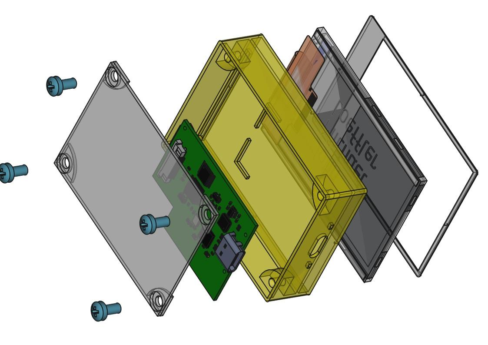
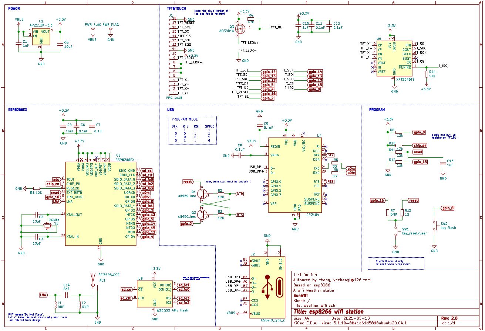
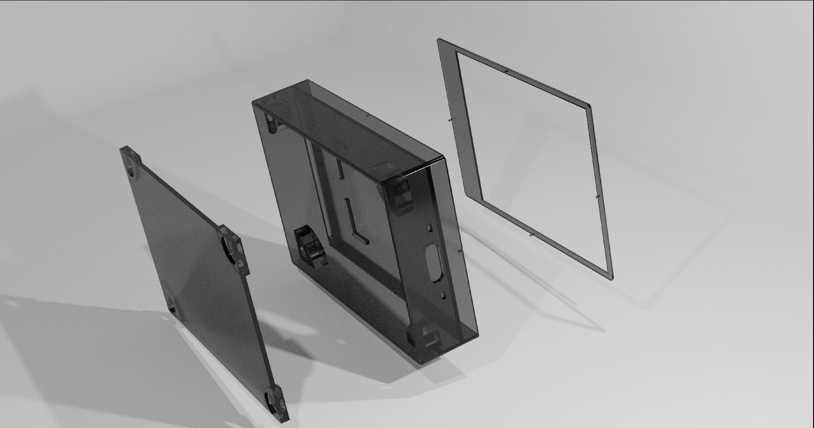

<!--  -->

	<b>A extension screen with wifi connection ability.</b>
	  
	
	
	
	

<!--     -->

其他语言版本: [English](README.en.md)

<!-- TODO add the bilibili video link -->

# 0. wifi触摸扩展屏

这是一个具有**wifi连接功能的2.4寸触摸小屏**，目前初始的软件版本上已加入了**天气预报和时钟**等功能，后续可以通过进一步的软件升级实现例如显示博客/视频观看量，粉丝计数，以及结合server作为远程控制的一个专用终端等等。

**整个项目从电路原理图设计，代码编写以及3d外壳的设计都是我一个人完成的**，整个项目的物料成本大概只有几十块钱。其中使用到的主控是esp8266ex,是一款来自乐鑫公司的在开源项目中非常流行的wifi芯片，也非常便宜。屏幕是一块采用ILI9341驱动的2.4寸TFT屏幕，同时用了一颗XPT2046驱动其上的触摸屏用来交互控制。

***这个是我的第一个涉及电路、软件、3d建模设计整个流程的完整个人项目，欢迎大家star关注！***

> 这个也是我首次尝试完全使用**开源平台**进行全流程的开发，整个项目中基本没有使用任何商业软件和框架，这个过程中越发感觉到开源世界的魅力和强大，也是在这里为开源世界做一份小小的参与~

**开发平台**

基本所有开发过程都在我的`thinkpad x1c`上进行，使用的linux发行版是我比较熟悉的`ubuntu20.04`版本，由于后续采用的也都是开源平台，因此基本不用担心平台兼容的问题，即使没有对应的二进制预编译版本最终也可以通过自己编译源码来使用。不得不说现在ubuntu的图形界面稳定性已经做的相当高了，整个过程中基本没有发生异常崩溃。

# 1. 电路设计

这里选用的是开源的kicad[^1], 由于第一次全流程开发，所以特意电路上没有加入太多复杂元素，但没想到还是中间出现了很多问题，第一版本花了相当长的时间调试排查，第二版本才成功。

## 1.1 原理图设计

设计之前首先是构思和芯片选型，这个过程中主要是大量的技术手册阅读，分析每个芯片的技术属性如供电电流、耐压值等等，然后就根据手册内容以及自己的构思进行原理图设计，可能工作以来主要都是做软件这块，对于硬件还是不够熟悉，第一版原理图就出现了很多错误，原本以为应该时间花费最小的环节却导致花了最多的时间进行排查，这个过程踩了很多坑，也比较痛苦，差一点因此放弃:skull:，不过好在还是坚持下来，想了很多办法最终排查出所有的硬件设计问题并在第二版本修正成功了:smile:

>  在原理图上我也标出了一些之前踩坑的地方以供大家参考。

## 1.2 pcb设计

这个项目的目标是尽可能小，所以pcb封装上选用的都是qfn这类小封装，成品效果基本硬币大小，但这也导致后面的硬件排查变得非常困难，后面如果在没有太大把握的情况下第一版pcb应该尽可能多引出测试口并设计得大一些方便排查。

* 2.4g 天线设计

pcb设计中主要需要注意的一点项目中需要2.4gHz的wifi天线，而2.4gHz频段对应的合适天线长度大约是30.6mm，因此一般直接用pcb走线实现是完全足够了，关于天线设计这里我也查找了很多资料，这里非常推荐大家看一下TI的[DN035](doc/ref/antenna_choose_ti_dn035.pdf)这篇文档，给出很多不同频率的简易天线设计，因为射频天线是非常专业的领域，可以直接拿过来参考使用即可，想更具体了解的可以参考这篇文章[How to Design a PCB Antenna for 2.4GHz](https://circuitdigest.com/article/how-to-design-a-pcb-antenna-for-24ghz)

# 2. 外壳3d建模

外壳设计采用的是freecad[^2],软件的设计逻辑过程还是比较简明易懂的，不过需要注意的是目前需要使用最新的`0.19`开发版本，这个版本虽然还没有正式发布但相对于当前的发布版本`0.18`修正了很多稳定性问题，可以直接去github上下载最新滚动开发版本。

这里我也给出了外壳的stl文件，可以直接拿去给商家进行3d打印

# 3. 软件代码

软件框架上用的是Arduino[^3]，很多朋友应该都很熟悉，其中gui框架由于esp8266的硬件限制不能应用相对复杂的例如[lgvl](https://lvgl.io/), 因此找了一种简单的gui库minigfx[^4], 也可以实现基本的图形切换、滑动效果等等，后面的项目会考虑使用资源跟充足的芯片使用更为完善的gui系统。

由于esp8266可以在ap和station模式切换，ROM空间也有4Mb大小，因此这个项目后续的软件升级空间很大，目前想到的几个升级思路如下：

- [ ] 使用wifi ota升级固件
- [ ] 加入ap server功能，用于手机直接传输wifi接入点密码等功能
- [ ] 加入信息终端功能，通过web api显示例如视频网站粉丝点赞数等信息
- [ ] ... 欢迎提issue交流~

# 4. 涉及到的工具和框架

以下是项目中使用到的主要的工具和框架，完全是开源的，跟商业软件相比，很多开源工具是缺少中文文档的，在使用上需要较好的英文文档阅读能力，同时稳定性等方面往往会有些问题，也需要较好的错误定位排查能力。但开源软件的扩展性和定制性都非常良好，甚至可以根据自己的需求写一些插件甚至直接修改源码去满足自己的需求，也没有商业软件付费限制等等问题，这个过程中会充分感觉一种自由感，还是非常推荐大家尝试的

[^1]: [kicad, 开源的EDA设计软件](https://www.kicad.org/)  
[^2]: [freecad, 开源的3d建模软件](https://www.freecadweb.org/)  
[^3]: [arduino, 世界最大的开源硬件项目](https://www.arduino.cc/)  
[^4]: [minigfx](https://github.com/ThingPulse/minigrafx)  
